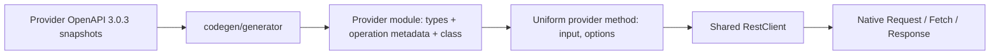

# Generated REST Client Design and Quality Review

Reviewed: 2026-08-26

## Scope

This review covers every file under `src/generated/`, every file under `codegen/generator/`, the
shared runtime in `src/rest.ts`, its current tests, package exports, and the normalized OpenAPI
inputs where needed to verify generated-contract fidelity. The existing
[capability matrix](../rest-client-capability-matrix.md) was used as supporting inventory.

Target design:

- reusable clients for Azure DevOps, Bitbucket, Codeberg, Gitea, GitHub, and GitLab;
- one deterministic client shape across providers;
- direct representation of each provider's own REST contract;
- no cross-provider semantic normalization;
- correct native-Fetch behavior, including cancellation, media handling, and errors.

## Verdict

**Not good to go unchanged.**

Core architecture is worth keeping. Generator produces a coherent and deterministic provider
surface, and shared `RestClient` is a good foundation. Current implementation is not yet safe to
call production-quality because generated types and runtime behavior disagree for documented
responses, at least one emitted request body cannot be serialized, `parseAs` makes every typed
method unsound, cancellation does not cover asynchronous auth/hooks, conditional schema requirements
are lost, and release gates are much smaller than risk surface.

Recommended direction is surgical hardening, not rewrite and not provider normalization.

## Design overview

Generator pipeline is small and understandable:

1. Discover normalized provider documents in stable lexical order.
2. Parse normalized OpenAPI 3.0.3.
3. Collect component schemas plus `paths` and Azure `x-ms-paths` operations.
4. Allocate deterministic, collision-safe TypeScript identifiers.
5. Emit component aliases, per-operation input/response aliases, operation metadata, and one thin
   provider class.
6. Emit aggregate exports and remove stale generated modules.

Main implementation points are [generation lifecycle](../../codegen/generator/generate.ts#L131),
[provider rendering](../../codegen/generator/generate.ts#L187),
[operation collection](../../codegen/generator/generate.ts#L309),
[schema rendering](../../codegen/generator/schema.ts#L11), and
[stable naming](../../codegen/generator/naming.ts#L115).

Generated provider classes use composition: each owns or receives one `RestClient`, exposes it as
`.rest`, and delegates every provider method to it. This is better than a provider inheritance tree:
transport policy remains centralized while provider types and names remain direct.

## Corpus shape

| Provider         | Operations/methods |       Lines |          Bytes |
| ---------------- | -----------------: | ----------: | -------------: |
| Azure DevOps     |                112 |      12,082 |        357,134 |
| Bitbucket        |                297 |      24,735 |        861,625 |
| Codeberg         |                506 |      30,810 |        876,939 |
| Gitea            |                536 |      32,678 |        833,405 |
| GitHub           |              1,221 |     158,288 |      5,507,954 |
| GitLab           |              1,149 |      88,753 |      2,780,775 |
| Generated barrel |                  — |          13 |            648 |
| **Total**        |          **3,821** | **347,359** | **11,218,480** |

Whole-corpus inspection found 10,229 exported types. Every operation has a one-to-one registry
entry, class method, input type, and response type. Registry keys and methods are lexically sorted.
Every method accepts `options?: RestRequestOptions` and forwards it unchanged.

## Quality scorecard

| Area                                   | Result   | Assessment                                                                                                                |
| -------------------------------------- | -------- | ------------------------------------------------------------------------------------------------------------------------- |
| Direct provider naming and wire fields | Good     | Provider operation IDs, paths, parameters, media types, and quoted wire property names are retained.                      |
| Common public shape                    | Good     | All six clients use the same constructor, `.rest`, `(input, options)`, and response envelope.                             |
| Current-snapshot determinism           | Good     | Stable ordering/naming and isolated regeneration produced byte-identical output.                                          |
| Runtime/type agreement                 | **Fail** | Documented response and request types can disagree with actual serializer/parser output.                                  |
| Cancellation                           | Partial  | `AbortSignal` reaches native Fetch, but cannot promptly cancel asynchronous auth and hooks.                               |
| Error handling                         | Partial  | Typed HTTP failures are good; parse, network, abort, and undocumented-body behavior needs a precise contract.             |
| Schema fidelity                        | **Fail** | Conditional required fields and lossless `int64` semantics are not preserved. Unsupported input can be silently weakened. |
| Runtime operation metadata             | Partial  | Useful registry exists, but exact keys are erased and runtime freezing is shallow.                                        |
| Package ergonomics                     | **Fail** | Only aggregate root export exists, loading all six large provider modules under native ESM.                               |
| Verification gates                     | **Fail** | Nine tests pass, but there are no full generator fixtures, wire conformance matrix, or generation-freshness gate.         |

## What is already well designed

### Generated client shape

- Provider-specific names and schemas remain provider-specific. No common issue, pull request,
  pagination, error, or repository model is invented.
- Inputs are predictably grouped as `path`, `query`, `headers`, and media-tagged `body`.
- Required path/body fields become required method input fields; parameter wire names remain exact.
- Multiple request media are represented as a discriminated `RestBody<mediaType, value>` union.
- Responses are discriminated by documented status and media type, with `RestUndocumentedResponse`
  for forward compatibility.
- Provider namespaces in [generated exports](../../src/generated/mod.ts#L1) prevent thousands of
  model names from colliding.
- Operation metadata provides a useful low-level adapter surface beside convenience methods.

### Shared transport

- Native Fetch types avoid a runtime HTTP dependency.
- Injectable `fetch`, lazy headers, request/response hooks, per-request overrides, and raw
  `client.rest.fetch()` are valuable extension points.
- Request-local construction is concurrency-friendly.
- Header precedence is sensible: configured/lazy headers, generated input headers, computed content
  negotiation, then explicit request overrides.
- Base-path joining, deterministic query ordering, and multi-segment path escaping are centralized.
- HTTP failures can be returned as typed union members or thrown as `RestApiError`.
- No automatic retries is a good default. Retry safety depends on provider rate limits, idempotency,
  and operation semantics; custom Fetch can add provider-aware policy.
- No disposal API is needed for this stateless native-Fetch wrapper.

### Cancellation already present

`RestRequestOptions` retains native `RequestInit.signal` ([`src/rest.ts`](../../src/rest.ts#L97));
generated methods forward options ([`generate.ts`](../../codegen/generator/generate.ts#L627));
runtime spreads them into `Request` ([`src/rest.ts`](../../src/rest.ts#L215)). A runtime probe
confirmed an aborted signal reaches Fetch and rejects with the original `AbortError`. This
foundation should remain.

## Must-fix correctness findings

### 1. Generated response types disagree with automatic parsing

Generator uses OpenAPI schema type for every response media
([`generate.ts`](../../codegen/generator/generate.ts#L554)). Runtime instead returns:

- parsed data for JSON media;
- `string` for `text/*`, XML, and YAML;
- `Blob` for other media ([`src/rest.ts`](../../src/rest.ts#L530)).

Whole-corpus audit found **1,318 documented media branches across 509 operations** whose generated
body type is incompatible with automatic parser output:

| Provider     | Mismatched branches | Affected operations | Example                                                                                                                         |
| ------------ | ------------------: | ------------------: | ------------------------------------------------------------------------------------------------------------------------------- |
| Azure DevOps |                   6 |                   3 | Blob/zip response typed `GitBlobRef` in [`BlobsGetBlobResponse`](../../src/generated/azure-devops.ts#L4279)                     |
| Bitbucket    |                  40 |                   6 | Multipart response typed `Snippet`/`Error` in [`GetSnippetsWorkspaceEncodedIdResponse`](../../src/generated/bitbucket.ts#L8740) |
| Codeberg     |               1,265 |          496 of 506 | `text/html` branches use object schemas, while runtime returns strings                                                          |
| GitHub       |                   7 |                   4 | Vendor diff/patch/SHA media are typed as strings or models but runtime returns `Blob`                                           |
| Gitea        |                   0 |                   0 | No mismatch found in current snapshot                                                                                           |
| GitLab       |                   0 |                   0 | No media-class mismatch found in current snapshot                                                                               |

Additional response unsoundness:

- `parseAs` is accepted by every generated method, but modes such as `text`, `stream`, and
  `response` change runtime body representation without changing return type
  ([options](../../src/rest.ts#L86), [method emission](../../codegen/generator/generate.ts#L627)). A
  probe of `GitHubRestClient.metaGet(..., { parseAs: "text" })` returned a runtime string while
  TypeScript still promised `ApiOverview`.
- Missing `Content-Type` is parsed as text first, then can be labeled as the operation's single
  documented JSON media type ([parse](../../src/rest.ts#L543), [matching](../../src/rest.ts#L571)).
  Result can claim an object while containing a string.
- Statuses with no declared content are marked documented even when server returns an unexpected
  media/body ([matching](../../src/rest.ts#L568)).
- Runtime forces 204/205 body to `undefined`, but 16 current GitLab 204 branches declare JSON
  bodies; for example, generated type promises `ApiEntitiesClusterGroup`
  ([GitLab response](../../src/generated/gitlab.ts#L22346)). HTTP no-content semantics and emitted
  type must agree.
- Automatic parsing consumes native `Response` body. Stored `response` remains useful for status and
  headers, but not for rereading body; ownership needs explicit documentation and tests.

### 2. Default `Accept` can exclude successful representation

`preferredResponseMediaType()` selects one preferred media across every status and prioritizes JSON
([`src/rest.ts`](../../src/rest.ts#L510)). Error JSON therefore wins over successful binary/text
media for five Codeberg operations: action job logs, action run logs, raw file, raw LFS file, and
SSH signing key.

For `repoGetActionRunLogs`, success is `application/zip` while errors are JSON/HTML
([operation metadata](../../src/generated/codeberg.ts#L20276)). Runtime probe confirmed default
request sends `Accept: application/json`.

### 3. Some generated request bodies cannot be serialized correctly

- Gitea release attachment exposes an `application/octet-stream` body as an object containing
  `attachment: RestBinary` ([generated input](../../src/generated/gitea.ts#L12050)). Runtime accepts
  only direct `BodyInit` for that media and throws `Cannot serialize application/octet-stream`
  ([serializer](../../src/rest.ts#L433)).
- Multipart schemas can expose `ReadableStream` through `RestBinary`, but `FormData` conversion only
  handles `Blob`, `ArrayBuffer`, and array-buffer views. A stream falls through to object JSON
  serialization ([form conversion](../../src/rest.ts#L456)).
- Top-level nullable JSON bodies are legal in 15 current GitHub operations. Runtime maps both
  `undefined` and `null` to no body before JSON serialization
  ([serializer](../../src/rest.ts#L433)); JSON `null` must be serialized as the bytes `null`.
  [`GistsUpdateInput`](../../src/generated/github.ts#L93703) is one concrete nullable body.

### 4. Conditional required fields are lost

Schema renderer only makes properties required when they are declared in the same object schema
([`schema.ts`](../../codegen/generator/schema.ts#L100)). It cannot apply a `oneOf` branch's
`required` list to properties declared by outer schema.

Current GitHub snapshot has 57 schemas with this pattern. Check-run schema requires `conclusion`
when `status` is `completed`
([normalized schema](../../codegen/specs/normalized/github.json#L49895)), but generated completed
variant leaves `conclusion` optional ([generated input](../../src/generated/github.ts#L85528)).
Invalid provider requests therefore type-check.

### 5. Cancellation does not cover complete asynchronous pipeline

Native Fetch cancellation works. End-to-end cancellation does not:

- lazy header/auth callback is awaited before `Request` and its signal are constructed
  ([request flow](../../src/rest.ts#L199));
- header callback receives only `operation`, not request signal
  ([client options](../../src/rest.ts#L116));
- async `beforeRequest` and `afterResponse` promises are awaited without a signal race;
- no test covers pre-abort, abort during auth/hook, abort during response parsing, or
  `AbortSignal.timeout()`.

Native signal should remain timeout mechanism; a second custom timer API is not needed. Pipeline
must become signal-aware and reject promptly at every asynchronous stage.

### 6. Success helpers lose useful body types

Every generated response union includes `RestUndocumentedResponse`, whose body is `unknown`.
`isRestSuccess()` preserves successful undocumented branch, so `response.body` remains `unknown`
after README-recommended narrowing ([helper](../../src/rest.ts#L301)).

`unwrapRestResponse()` maps every non-success/undocumented union member to `unknown`; `unknown`
absorbs known successful body members, so generated-call results also unwrap to `unknown`
([helper](../../src/rest.ts#L308)).

Keep an honest helper for any successful response, but add documented-success narrowing and an
unwrap variant that throws for HTTP failure **and** undocumented response before returning
`Extract<T, { documented: true; ok: true }>["body"]`.

## Important hardening findings

### Schema and contract fidelity

- Every OpenAPI `integer`/`number`, including `int64`, becomes JavaScript `number`
  ([`schema.ts`](../../codegen/generator/schema.ts#L94)). Current inputs contain 1,352 `int64`
  occurrences. Values above `Number.MAX_SAFE_INTEGER` cannot round-trip. A deliberate lossless
  integer policy is required; blindly switching all fields to `bigint` would break native JSON.
- Response header contracts are discarded. Audit found 1,430 operation-response header uses after
  resolving refs. Raw `Headers` preserves access, but continuation, pagination, rate-limit, and
  location headers are neither discoverable nor typed. `ResponseModel` currently stores only status,
  description, and content ([model](../../codegen/generator/generate.ts#L91)).
- Generator silently skips invalid/unsupported operations, parameters, and responses rather than
  reporting loss ([operation collection](../../codegen/generator/generate.ts#L320),
  [parameter collection](../../codegen/generator/generate.ts#L424),
  [response collection](../../codegen/generator/generate.ts#L474)). Unresolved/non-component schema
  refs can degrade to `unknown` ([`schema.ts`](../../codegen/generator/schema.ts#L23)).
- Reusable metadata advertises `allowReserved` and `deepObject`, but serializer ignores
  `allowReserved` and does not emit deep-object bracket syntax ([metadata](../../src/rest.ts#L22),
  [serializer](../../src/rest.ts#L368)). Current six normalized snapshots do not exercise those
  features, but generator must either support or reject them.
- Path/header style, response links, callbacks, security metadata, server variables, request-body
  encoding, cookie parameters, and several schema keywords are not represented. Most are absent in
  current normalized snapshots. They need explicit diagnostics so future upstream changes cannot
  silently weaken clients.

### Operation metadata

Registry is emitted as `Readonly<Record<string, RestOperation>>`
([`generate.ts`](../../codegen/generator/generate.ts#L288)). This erases exact keys: any misspelled
lookup type-checks as `RestOperation` but returns `undefined` at runtime. `Object.freeze()` is also
shallow; nested descriptors and arrays remain mutable.

Emit exact literal keys using `as const satisfies`, then choose and test a runtime immutability
policy that does not impose unacceptable module-startup cost.

### Public-name stability

Naming is deterministic for one input snapshot but not stable across upstream evolution. When a new
symbol collides, allocator hashes every member of collision group, renaming existing public API
([`naming.ts`](../../codegen/generator/naming.ts#L129)). Current output already has 47 opaque hashed
operation names: 45 GitLab and 2 Gitea. Bitbucket lacks upstream `operationId` for 197 of 297
operations, increasing path-derived name churn.

Persist and review public symbol mapping, reserve Promise-like and TypeScript utility names, and
fail compatibility gate on unexplained renames.

### Generation safety

- Provider files are overwritten sequentially before barrel emission and stale cleanup
  ([generation](../../codegen/generator/generate.ts#L131)). Failure can leave mixed snapshot.
- Missing normalized providers are accepted; stale cleanup can then remove prior provider modules
  ([cleanup](../../codegen/generator/generate.ts#L664)). Expected provider set/count needs an
  invariant.
- Current normalized snapshots regenerate byte-identically, but there is no checked `generate:check`
  task equivalent to `graph:check`.
- Full `codegen` fetches moving upstream latest documents, so release reproduction must use pinned
  normalized inputs or recorded source hashes rather than refetching during publish.

### Package and module shape

[`jsr.json`](../../jsr.json#L4) exposes only root `mod.ts`. Root statically re-exports all six
providers through [`src/generated/mod.ts`](../../src/generated/mod.ts#L1). Native ESM therefore
instantiates all provider modules and all 3,821 operation registries even when consumer needs one
client or only `RestClient`; `deno info mod.ts` reports a 10.72 MB dependency graph.

Keep aggregate root for compatibility, but add public `./rest` and six provider subpaths. Then
measure whether splitting each large provider into types/operations/client modules materially
improves Deno startup, editor, and type-check performance before taking larger topology change.

### Runtime consistency and safety

- `RestClientOptions.query` says values apply to every request, but raw `fetch()` does not append
  them ([option](../../src/rest.ts#L121), [raw path](../../src/rest.ts#L254)).
- Public `baseUrl` is a mutable `URL`, and configured static header/query objects remain
  caller-owned references ([state](../../src/rest.ts#L150)). External mutation can change later
  requests and complicate concurrency reasoning.
- Absolute operation servers receive configured authorization headers by default. GitHub upload
  server requires this behavior ([metadata](../../src/generated/github.ts#L128132)), but
  cross-origin credential policy needs an explicit allow/test/documented contract.
- Invalid JSON, including error JSON, throws `SyntaxError` before `throwOnError` can create
  `RestApiError`. Abort, transport, parse, documented HTTP, and undocumented response failures need
  distinct tested semantics.

## Provider-source limitations, not normalization failures

These should remain visible rather than be hidden behind a fake common contract:

- Azure snapshot declares no non-2xx response branches.
- Gitea models a body for only 1 of 957 documented error variants.
- GitLab models a body for 0 of 2,706 documented error variants.
- Codeberg source duplicates object schemas under pervasive `text/html` response branches.
- Most object schemas remain open as `Record<string, unknown>` because upstream documents generally
  omit `additionalProperties: false`. This is forward-compatible but allows request-key typos.
  Generator should not close them without provider evidence.
- Server constants directly mirror source and include relative Codeberg, placeholder Gitea, and
  protocol-relative GitLab values. Requiring explicit constructor `baseUrl` is therefore the right
  current behavior; constants must be documented as raw spec metadata, not guaranteed defaults.

No common paginator, auth model, retry model, error body, or normalized resource API is recommended
here. Provider-native helpers can be considered separately only when they preserve provider
contract.

## Required iterative improvement plan

Baseline already proven:

- [x] All 3,821 operations have matching methods, inputs, responses, and metadata.
- [x] Generated registries and methods are deterministically sorted.
- [x] Current normalized snapshot regenerates byte-for-byte.
- [x] `deno task check`, `deno task lint`, `deno fmt --check`, `deno task test`, and
      `deno task graph:check` pass.

### Iteration 0 — Build gates before behavior changes

- [ ] Add focused generator fixtures for schema composition, status/media responses, body media,
      parameters, servers, headers, naming collisions, and unsupported features.
- [ ] Add whole-corpus invariant test for six expected providers, operation counts, and one-to-one
      type/metadata/method delegation.
- [ ] Add `generate:check` that regenerates in isolation and compares every output byte.
- [ ] Emit machine-readable lossy/unsupported-feature diagnostics and fail on unreviewed entries.
- [ ] Render and validate every provider before atomically replacing generated tree.
- [ ] Refuse missing expected provider inputs unless explicitly requested.

Exit gate: every current defect below has a failing regression test or explicit diagnostic.

### Iteration 1 — Make response types and runtime parsing agree

- [ ] Add media-specific decode metadata derived from both schema and content type.
- [ ] Reduce 1,318 parser/type mismatches to zero.
- [ ] Select default `Accept` from successful response media; fix all five Codeberg cases.
- [ ] Match status/media before parsing and define missing/unexpected `Content-Type` behavior.
- [ ] Enforce 204/205 no-content types consistently.
- [ ] Remove `parseAs` from typed generated options or make return type conditional on parse mode.
- [ ] Define typed parse-failure behavior without conflating it with HTTP failure or abort.
- [ ] Decide and test default ownership for large binary responses: buffered `Blob` versus stream.

Exit gate: JSON, text, vendor text, binary, multipart, empty, malformed, default, and undocumented
response fixtures have exact runtime/static agreement.

### Iteration 2 — Make every emitted request body serializable

- [ ] Serialize top-level JSON `null` as `null`, while preserving `undefined` as absent body.
- [ ] Correct Gitea octet-stream attachment shape through an explicit generator rule or reviewed
      provider-source correction.
- [ ] Separate raw-body binary type from FormData-compatible binary field type.
- [ ] Test JSON, text, octet-stream, multipart, URL-encoded, Blob, bytes, and stream branches.
- [ ] Apply configured global query to raw `fetch()` or narrow its documented promise.
- [ ] Implement or hard-reject every advertised query/path/header serialization style.

Exit gate: every request media branch emitted in all six clients has a successful serialization
fixture; zero branch relies on accidental coercion.

### Iteration 3 — Complete cancellation and error semantics

- [ ] Pass request context including `AbortSignal` to lazy auth and asynchronous hooks while
      preserving a deliberate compatibility path.
- [ ] Check/race signal before and after every awaited pipeline stage.
- [ ] Test pre-abort, abort during auth, before-request hook, Fetch, after-response hook, and body
      parsing, including `AbortSignal.timeout()`.
- [ ] Keep native abort identity distinct from transport, parse, HTTP, and undocumented-response
      failures.
- [ ] Define stream cancellation/body ownership.
- [ ] Clone or encapsulate mutable base URL and configured request defaults.
- [ ] Test operation-server credential forwarding policy.

Exit gate: cancellation latency and error category are deterministic at every asynchronous stage.

### Iteration 4 — Restore schema and metadata fidelity

- [ ] Preserve branch-dependent `required` fields; clear all 57 GitHub conditional-required losses.
- [ ] Decide and implement explicit lossless `int64` policy with path/query/JSON request/response
      fixtures.
- [ ] Preserve typed response-header contracts without replacing native `Headers`.
- [ ] Emit exact-key, deeply readonly operation registry types and deliberate runtime immutability.
- [ ] Fail generation on unresolved refs and silent operation/parameter/response loss.
- [ ] Separate request/response schema contexts where read-only/write-only semantics require it.
- [ ] Add documented-success narrowing and useful typed unwrap helper.

Exit gate: zero unexplained lossy diagnostics and compile-time fixtures reject known-invalid
provider requests.

### Iteration 5 — Stabilize public API and package loading

- [ ] Persist reviewed operation/type name manifest and compatibility-check every regeneration.
- [ ] Reserve `then`, Promise-like methods, runtime imports, and TypeScript utility/global names.
- [ ] Improve semantic disambiguation before hash suffixes without renaming accepted public names.
- [ ] Add `./rest` plus six public provider subpath exports; retain aggregate root.
- [ ] Add import-graph smoke tests proving provider subpath loads only provider runtime plus shared
      transport.
- [ ] Prototype provider module splitting and keep it only if measured startup/editor/type-check
      gains justify added topology.

Exit gate: no unexplained public rename and single-provider consumers do not load unrelated
registries.

### Iteration 6 — Provider-by-provider contract loop

For each provider, add representative wire fixtures for authentication headers, pagination form,
rate-limit/continuation headers, text/binary downloads, uploads, errors, and operation-level
servers. Treat incomplete upstream descriptions as explicit provider-specific diagnostics. Do not
invent cross-provider models to make metrics look complete.

Exit gate: every accepted provider limitation is documented; every fix remains provider-direct and
uses common transport shape only.

### Loop protocol for every iteration

1. Add one failing fixture or corpus diagnostic for one defect class.
2. Make smallest generator/runtime change that fixes it.
3. Regenerate all six providers in isolation.
4. Inspect generated diff and public-name manifest.
5. Re-run corpus diagnostics and verify no provider regressed.
6. Run `deno task check`, `deno task lint`, `deno fmt --check`, `deno task test`,
   `deno task generate:check`, and `deno task graph:check`.
7. Merge only with zero unexplained generated drift; repeat.

## Good-to-go definition

Clients become good to go when all conditions hold:

- [ ] Zero generated response branches disagree with default runtime body type.
- [ ] Zero generated request branches are unserializable.
- [ ] Zero silent unsupported/dropped OpenAPI constructs; every limitation is explicit and reviewed.
- [ ] Cancellation is tested across full async pipeline and keeps native abort semantics.
- [ ] Conditional-required and selected numeric fidelity policies are proven by type/runtime tests.
- [ ] Exact operation registry keys and public symbol names are compatibility-gated.
- [ ] All 3,821 current operations remain one-to-one unless a reviewed upstream change explains
      count.
- [ ] Aggregate and per-provider package imports are both supported and tested.
- [ ] Full generation is byte-stable from pinned normalized inputs.
- [ ] Every provider-specific source deficit is documented without fake normalization.
- [ ] All verification gates pass.

## Verification performed for this review

| Check                                                      | Result                                                       |
| ---------------------------------------------------------- | ------------------------------------------------------------ |
| `deno task check`                                          | Pass                                                         |
| `deno task test`                                           | Pass, 9 tests                                                |
| `deno task lint`                                           | Pass, 30 files                                               |
| `deno fmt --check`                                         | Pass, 35 files                                               |
| `deno task graph:check`                                    | Pass                                                         |
| Isolated generation + format versus current generated tree | Byte-identical                                               |
| Whole generated corpus method/registry/type consistency    | Pass, 3,821/3,821                                            |
| Native signal propagation probe                            | Pass, original `AbortError` observed                         |
| Generated `parseAs: "text"` type/runtime probe             | Fail as expected; static object, runtime string              |
| Codeberg run-log default `Accept` probe                    | Fail as expected; emitted `application/json` for ZIP success |

Current tests cover basic JSON request construction, one query serialization case, path encoding,
HTTP error return/throw, raw base paths, naming collision determinism, and two schema renderer cases
([runtime tests](../../src/rest_test.ts#L13),
[naming tests](../../codegen/generator/naming_test.ts#L1),
[schema tests](../../codegen/generator/schema_test.ts#L1)). They are valid but insufficient for
current 3,821-operation and multi-media surface.
