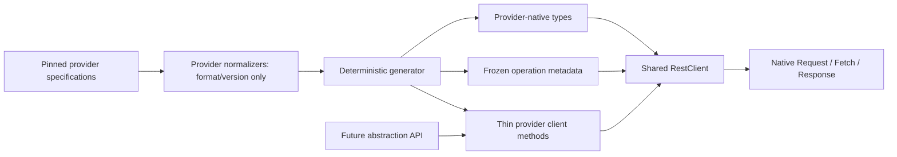

# Generated REST Client Final Excellence Review

Reviewed: 2026-08-26

## Verdict

**Excellent and good to use as the provider-native foundation for the future abstraction API.**

This verdict applies to the six pinned provider specifications currently in the repository: Azure
DevOps, Bitbucket, Codeberg, Gitea, GitHub, and GitLab. It is not a promise to validate malformed
future OpenAPI releases before they are introduced.

The specifications are authoritative. The generator does not carry a provider source-correction
layer, delete declarations, or normalize provider semantics. When a provider declaration conflicts
with HTTP, a media type, or native Fetch, the source remains intact and the exact limitation is
recorded in the corpus audit and tests.

No further remediation plan is required for the current corpus. A changed provider snapshot that
causes audit, static-contract, wire, name, generation-freshness, or package-graph drift reopens the
same review loop at that time.

## Scope and boundary

This layer provides deterministic low-level clients, not a common Git product model.

- Provider operation names, paths, parameters, media types, schemas, statuses, headers, security,
  and servers remain provider-specific.
- No repository, issue, pull request, pagination, authentication, retry, or error-body model is
  normalized across providers.
- No automatic retry policy is imposed.
- Provider specification defects are visible limitations, not silently corrected input.
- Future-spec validation is not an acceptance condition. New snapshots are evaluated when they are
  actually introduced.

## Resulting architecture



Every provider has the same mechanical shape:

1. A constructor accepting `RestClientOptions` or an existing `RestClient`.
2. A public `.rest` transport.
3. One method per provider operation.
4. Inputs grouped into provider-declared `path`, `query`, `headers`, and media-tagged `body` fields,
   plus exact optional-route selectors where the provider path declares them.
5. `RestGeneratedRequestOptions`, including native cancellation but excluding
   response-shape-changing `parseAs` overrides.
6. A response union discriminated by documented status, media type, `ok`, and `documented`, with an
   honest undocumented-response member.

The generated classes contain no provider business normalization. They delegate operation metadata
and input directly to the shared transport.

## Final corpus

Request counts are shown as JSON/form/text/binary. Response counts are shown as JSON/text/binary
decoder branches.

| Provider                 | Operations |  Request branches |  Response branches | Diagnostics |       Lines |          Bytes | Exported types |
| ------------------------ | ---------: | ----------------: | -----------------: | ----------: | ----------: | -------------: | -------------: |
| Azure DevOps             |        112 |          37/0/0/1 |             96/1/8 |           0 |      12,674 |        380,316 |            454 |
| Bitbucket                |        297 |          56/0/0/0 |           669/0/40 |         237 |      27,294 |        962,729 |            789 |
| Codeberg                 |        506 |        124/3/44/0 |      1,277/1,276/3 |         101 |      36,590 |      1,113,193 |          1,258 |
| Gitea                    |        536 |         138/3/1/1 |            367/4/2 |         956 |      41,801 |      1,080,395 |          1,304 |
| GitHub                   |      1,221 |         343/0/2/1 |          2,899/9/0 |         284 |     170,733 |      5,893,877 |          3,414 |
| GitLab                   |      1,149 |        418/10/0/3 |            779/0/1 |       2,814 |      93,261 |      2,922,342 |          3,010 |
| **Provider total**       |  **3,821** | **1,116/16/47/6** | **6,087/1,290/54** |   **4,392** | **382,353** | **12,352,852** |     **10,229** |
| Generated barrel         |          — |                 — |                  — |           — |          13 |            648 |              — |
| **Generated tree total** |  **3,821** |         **1,185** |          **7,431** |   **4,392** | **382,366** | **12,353,500** |     **10,229** |

All 3,821 operations have exactly one generated input alias, response alias, registry entry, and
delegating class method. Public methods and types remain locked by the reviewed name manifest.

## Generator assessment

The generator is a strong foundation for the current provider set:

- It renders all six expected providers from pinned normalized inputs in stable order.
- It stages and formats the entire tree, checks staged TypeScript, and replaces live output only
  after successful validation.
- Public names are checked against a reviewed manifest, including existing locked collision names.
- Provider registries, server metadata, and security metadata are deeply frozen. Class metadata is
  exposed through getter-only, non-configurable bindings, so JavaScript consumers cannot reassign
  it.
- The exact media audit compares every one of 1,185 request branches and 7,431 response branches.
- A balanced generated-source parser independently checks the emitted static request and response
  body syntax. Decoder metadata cannot conceal a wrong generated type.
- Generation freshness byte-compares every checked-in provider module.
- No provider source-correction module remains.

The generator deliberately preserves malformed current declarations. In particular, 78 GitLab
wildcard routes declare same-name query parameters instead of path parameters. Generated inputs now
retain those query parameters and synthesize separate route captures; tests prove both values are
sent independently. The other 16 missing GitLab route captures are also synthesized and diagnosed,
for 94 synthesized path captures total.

## Shared `RestClient` assessment

The base client is well designed for reuse:

- Native Fetch remains the only transport dependency, with injectable Fetch for testing or custom
  transport policy.
- URL joining, strict dynamic path escaping, provider optional-route groups, deterministic query
  serialization, headers, request bodies, response matching, and media decoding are centralized.
- JSON `null`, exact unsafe integer tokens, `bigint` request tokens, non-finite number rejection,
  multipart, URL-encoded, text, and binary families have direct wire tests.
- Generated methods cannot use `parseAs` to invalidate their generated response type. Raw requests
  retain every parse mode and raw `fetch()` remains available.
- Documented HTTP, undocumented response, parse, transport, and native abort failures remain
  distinguishable.
- Configured base URL, headers, and global query values are defensively snapshotted.
- Configured or lazy headers are applied against the final post-hook origin. Explicit request and
  hook-added headers win, preventing same-origin credential leakage after URL replacement.
- Arbitrary raw methods use an honest `RestRequestOperation` with `method: string`; generated
  registries retain the closed `RestMethod` union.

Cancellation uses one native `AbortSignal`. Tests cover pre-abort and abort during lazy headers,
`beforeRequest`, Fetch, `afterResponse`, parsing, returned streams, raw Fetch streams, and raw
`response`/`none` parse modes. Late request or response values are canceled, discarded bodies have
defined ownership, hostile never-settling cancellation cannot delay the abort result, and the
original abort reason is preserved.

## Original finding disposition

| Original finding                                                                       | Final disposition                                                                                                                                                   |
| -------------------------------------------------------------------------------------- | ------------------------------------------------------------------------------------------------------------------------------------------------------------------- |
| 1,318 generated response/runtime media mismatches across 509 operations                | Zero generated decoder/static-family mismatches. Source media/schema conflicts remain explicit provider limitations.                                                |
| Default `Accept` could prefer error JSON over successful text/binary                   | Successful representations are selected first and every compatible success media type is advertised deterministically.                                              |
| Gitea octet-stream attachment and other emitted request families were not serializable | Current wire policy is tested across all emitted media families. Four provider-declared GET bodies remain exact native Fetch limitations rather than being deleted. |
| Generated `parseAs` made response types unsound                                        | Generated options exclude `parseAs`; raw transport retains it with cancellation-safe ownership.                                                                     |
| Conditional `required` constraints disappeared                                         | Current conditional-required loss count is zero; schema-composition fixtures cover the renderer.                                                                    |
| `int64` lost precision                                                                 | `RestInt64` and exact JSON number handling preserve unsafe integral values as `bigint`; lossy or non-finite values fail explicitly.                                 |
| Cancellation stopped at native Fetch                                                   | Every asynchronous stage and every returned stream ownership mode is covered.                                                                                       |
| Success helpers returned `unknown`                                                     | Documented-success narrowing and typed unwrap preserve generated body types and reject undocumented results.                                                        |
| Response headers were not typed                                                        | All 1,430 response-header uses remain available through typed immutable `headerValues` and native `Headers`.                                                        |
| Registry keys were erased and metadata was mutable                                     | Exact literal keys are retained; registries and nested provider metadata are runtime-immutable.                                                                     |
| Generation could leave mixed output or rename public APIs silently                     | Whole-tree staged generation, type-check-before-swap, rollback tests, and the public-name manifest close both gaps.                                                 |
| Root import loaded every provider                                                      | `./rest` and six provider subpaths are declared and graph-tested; aggregate root remains available.                                                                 |

## Provider-spec limitations retained exactly

The 4,392 diagnostics describe current provider inputs; they are not a cross-provider normalization
backlog.

| Provider     | Exact diagnostics | Current provider limitations                                                                                                                                   |
| ------------ | ----------------: | -------------------------------------------------------------------------------------------------------------------------------------------------------------- |
| Azure DevOps |                 0 | Source declares no non-2xx response branches.                                                                                                                  |
| Bitbucket    |               237 | 197 operations lack `operationId`; 40 documented non-2xx responses lack bodies.                                                                                |
| Codeberg     |               101 | 58 documented non-2xx responses lack bodies; 43 `text/plain` request branches carry object schemas.                                                            |
| Gitea        |               956 | 956 documented non-2xx responses lack bodies; octet-stream attachment schema conflicts with its direct binary wire representation.                             |
| GitHub       |               284 | 280 documented non-2xx responses lack bodies; two malformed non-object `required` uses; one schema-less JSON GET body; that body is forbidden by native Fetch. |
| GitLab       |             2,814 | 2,706 documented non-2xx responses lack bodies; 94 missing route captures; 11 optional route groups; three required GET bodies forbidden by native Fetch.      |

Four generated GET request-body branches are intentionally present because the specifications
declare them: optional JSON on GitHub repository contents and required octet-stream bodies on three
GitLab RubyGems downloads. Native `Request` rejects any supplied GET body before Fetch. Tests assert
the exact generated types, metadata, error, and zero transport calls. The three GitLab methods are
therefore unusable through native Fetch as declared; this is an upstream contract limitation, not a
silently corrected client.

Other exact contradictions remain visible:

- 25 declared response media branches occur on HTTP 204/205 responses: Codeberg 6, Gitea 3, and
  GitLab 16. Generated/runtime envelopes follow HTTP no-content semantics while source metadata
  remains intact.
- Azure has 6 binary-media/object-schema response conflicts, Bitbucket has 40 multipart/object
  conflicts, and Codeberg has 1,265 text/object conflicts. Generated body types follow the selected
  wire decoder so callers receive the type actually returned by the transport.
- Most source objects remain open through `Record<string, unknown>` because the specifications do
  not close them. The generator does not invent stricter schemas.
- GitHub and GitLab specifications provide no effective security requirements in this snapshot; no
  common auth model is fabricated.
- Source server constants remain raw metadata, including relative, placeholder, and
  protocol-relative entries. Callers still provide an explicit usable base URL.

## Provider wire review

Deterministic fixtures now exercise:

- authentication, provider-native pagination, and typed response headers for all six providers;
- uploads for Azure DevOps, Codeberg, Gitea, GitHub, and GitLab, with Bitbucket's lack of a current
  form/binary upload branch asserted rather than fabricated;
- downloads for Azure DevOps, Bitbucket, Codeberg, Gitea, GitHub, and GitLab;
- documented errors for every provider that declares them, with Azure's zero-error inventory
  asserted;
- undocumented responses for all six providers;
- GitHub's operation-level upload server;
- all 12 concrete URL forms represented by GitLab's 11 optional route groups;
- distinct GitLab wildcard path and provider-declared query values;
- all four provider-declared GET-body/native-Fetch limitations.

No fixture introduces cross-provider semantics.

## Package isolation and measurements

Each provider subpath loads only its public wrapper, one generated provider module, and the shared
transport. `./rest` loads no generated provider. Measurements below are one local run; they justify
retaining the current provider-file topology rather than adding an internal split without evidence.

| Entry point      | Local modules | Local graph bytes | `deno check --reload` | In-process import |
| ---------------- | ------------: | ----------------: | --------------------: | ----------------: |
| `./rest`         |             2 |            54,158 |                 96 ms |              1 ms |
| `./azure-devops` |             3 |           434,534 |                136 ms |              3 ms |
| `./bitbucket`    |             3 |         1,016,941 |                212 ms |              7 ms |
| `./codeberg`     |             3 |         1,167,403 |                334 ms |             12 ms |
| `./gitea`        |             3 |         1,134,599 |                368 ms |             14 ms |
| `./github`       |             3 |         5,948,083 |                723 ms |             22 ms |
| `./gitlab`       |             3 |         2,976,548 |                646 ms |             18 ms |
| Aggregate root   |            10 |        12,407,792 |                915 ms |             55 ms |

## Final verification

The final current-corpus gates passed:

```text
deno fmt --check        # 56 files
deno task lint          # 39 files
deno task check         # passed
deno task test          # 94 passed, 0 failed
deno task generate:check # all six providers byte-current
deno task graph:check   # passed
```

Additional exact gates prove:

- 3,821 operations and one-to-one method/type/metadata coverage;
- 1,185 request branches and 7,431 response branches;
- zero generated decoder/static body-family mismatches under the reviewed wire policy;
- zero conditional-required losses in the current corpus;
- exact public-name manifest coverage;
- exact 4,392-entry diagnostic ledger;
- immutable generated registries, servers, and security metadata;
- isolated provider and transport package graphs.

## Final checklist

- [x] Current provider specifications remain authoritative and uncorrected.
- [x] All six providers regenerate deterministically from pinned inputs.
- [x] Generated types, decoder metadata, and runtime wire policy agree for every supported branch.
- [x] Current provider contradictions are exact, tested, and documented.
- [x] Cancellation and ownership cover every asynchronous and streaming stage.
- [x] Generation is atomic and public names are stable.
- [x] Runtime and generated metadata are immutable under the documented policy.
- [x] Provider subpath imports are isolated.
- [x] Provider-native wire fixtures cover the current supported matrix.
- [x] All final release gates pass.

The current clients are ready to support the future abstraction API. That future layer should adapt
provider concepts above these clients; it should not move normalization into the generated or
transport layers.
